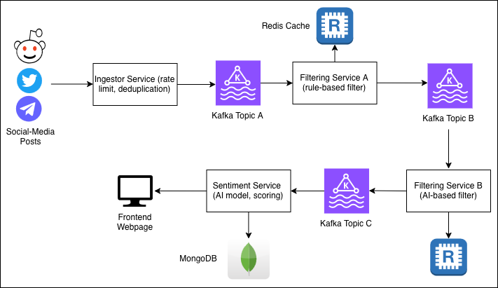

# Sentrix: Real-Time Social Sentiment by Stock Tickers

Sentrix is a microservice-based system that ingests social media discussions, filters low-quality/manipulative content, computes ticker-level sentiment signals, and serves them to a web dashboard.

This root README is a project map.
Detailed setup and runtime instructions are intentionally kept inside each microservice's README.

## What This Repository Contains

### Core microservices

| Service | Responsibility | Stack | Docs |
|---|---|---|---|
| Ingestor Service | Fetches source data (currently Reddit), normalizes into a common event schema, publishes to Kafka | Java + Spring Boot | `backend/ingestor-service/README.md` |
| Filtering Service A (Hard Gate) | Deterministic quality filtering, normalization, exact dedup, near-dup metadata | Java + Spring Boot + Redis | `backend/filtering-service-a/README.md` |
| Filtering Service B (Soft Gate) | Semantic relevance, manipulation scoring, novelty scoring, keep/reject decision | Python + FastAPI runtime + Redis + embeddings | `backend/filtering-service-b/README.md` |
| Sentiment Service (Worker) | Consumes filtered events, builds hourly aggregates, updates latest per-ticker signal | Python + Kafka + MongoDB | `backend/sentiment-service/README.md` |
| Sentiment Service (API) | Serves ticker sentiment and latest signal endpoints to clients | FastAPI + MongoDB | `backend/sentiment-service/README.md` |
| Frontend | Dashboard, ticker detail view, analytics charts, watchlist sentiment monitor | Next.js + TypeScript | `frontend/README.md` |

### Supporting directories

- `backend/` - backend service code and service-specific docs
- `frontend/` - web application
- `docs/` - architecture and sequence diagrams
- `api-testing/` - service testing scripts and experiments

## End-to-End Pipeline

### Data flow

```text
Reddit source
  -> Ingestor Service
  -> Kafka: sentrix.ingestor.events
  -> Filtering Service A
  -> Kafka: sentrix.filter-service-a.cleaned
  -> Filtering Service B
  -> Kafka: sentrix.filter-service-b.filtered
  -> Sentiment Worker
  -> MongoDB (hourly + latest signal collections)
  -> Sentiment API
  -> Frontend Dashboard
```

### Pipeline diagram image




## Kafka Topic Contracts (Current)

- `sentrix.ingestor.events`: normalized raw events from ingestor
- `sentrix.filter-service-a.cleaned`: Service A keep output
- `sentrix.filter-service-a.dropped`: Service A drop output
- `sentrix.filter-service-b.filtered`: Service B keep output (consumed by Sentiment Worker)
- `sentrix.filter-service-b.rejected`: Service B reject output

## Where To Find Setup Instructions

This root README does not duplicate setup steps.
Use the docs below depending on what you need:
- Ingestor service setup: `backend/ingestor-service/README.md`
- Filtering Service A setup: `backend/filtering-service-a/README.md`
- Filtering Service B setup: `backend/filtering-service-b/README.md`
- Sentiment service setup (worker + API): `backend/sentiment-service/README.md`
- Frontend setup: `frontend/README.md`

## Current Deployment Setup

Current deployment is service-based (not a single monolith deployment):

- Application hosting: Railway (separate services per component)
  - Ingestor Service: Railway monorepo deploy from `backend/ingestor-service`
  - Filtering Service A: Railway monorepo deploy from `backend/filtering-service-a`
  - Filtering Service B: Railway deploy from Docker image (`wasiflh/filtering-service-b`)
  - Sentiment Worker: Railway service from `backend/sentiment-service`
  - Sentiment API: Railway service from `backend/sentiment-service`
  - Frontend: Railway service from `frontend`
- Messaging backbone: Confluent Cloud Kafka (SASL/SSL in cloud)
- Cache/state stores: Redis (used by filtering stages for dedup/repetition/novelty state)
- Persistent analytics store: MongoDB Atlas (hourly aggregates + latest ticker signals)
- CI/CD: GitHub Actions used for automated build/publish for Filter B Docker image

## Development Workflow

- Do not push directly to `main`
- Create a branch (`feature/*`, `fix/*`, `docs/*`, etc.)
- Open PR into `main`
- Update the relevant service README whenever behavior/config changes

## Notes

- Secrets must stay out of git; use `.env.*.example` templates
- Service-level environment variable details are maintained in each service README
